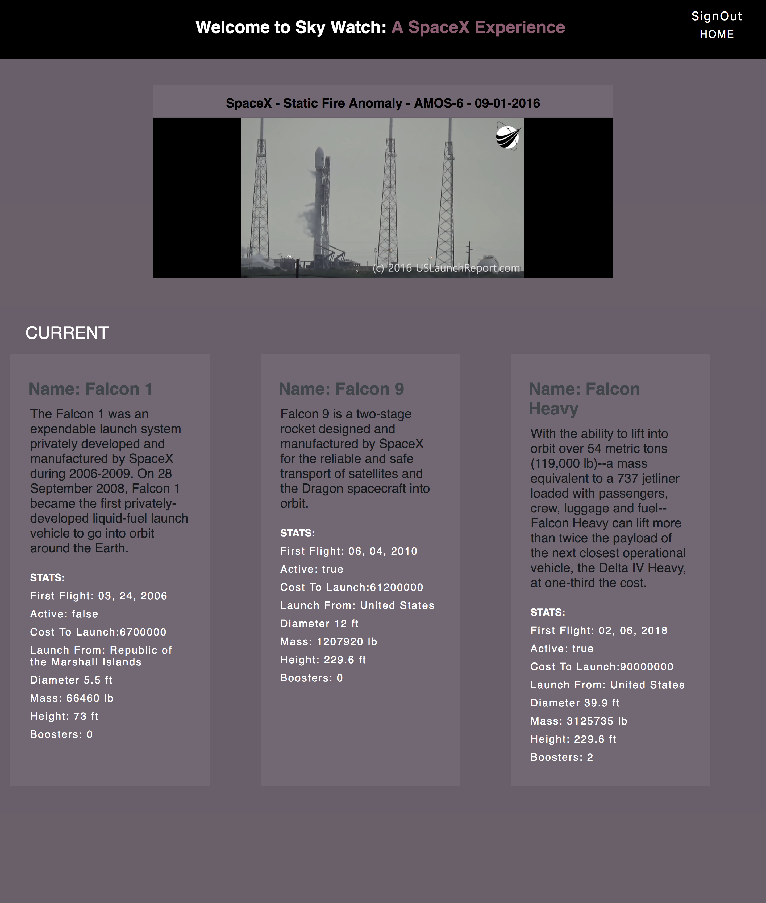

# Sky Watch

## Sabrina Kennedy https://github.com/skenne21;

##Synopsis:
This was a two week personal project built for the Turing School of Software and Design, using React.js, React-Router, Redux, and Google Firebase. The idea and implementation of this application was created and carried out on an individual basis. As a person that is excited about the technologies of SpaceX, I wanted to build an App that was an educational and got users about advances in SpaceX is doing for space travel. I built this App using the SpaceX API and youTube API

##Implementation:
The project is built in React.js with Google Firebase as a backend for user authentification and database storage. The create-react-app was used as the starter, which documentation can be found here.

##Tests:
Jest and Enzyme are used to test the application and can be run using npm test

##Installation:
Clone down the repo and run npm install

Since Firebase is used as the backend, you will need to create a firebase database for this repository and copy the individual config code firebase provides and place this config in the apikey.js and store in as an object named config. This repo uses the youTube API which you will need to create a API key varible and name it youTubeKey and store it in a file named apiKey.js in the src file and store it  .

The application is now ready to run using the code npm start;

Clone this project

Run `npm install` from the root directory

Run `npm start`

You can run the testing suite with `npm test`.

## Future:
In the future I would like to create a page that allows users to view current launches of spaceX, keep track of the next launch date and use data visualizations to show the procress of the launches over time. 

## Screenshot

